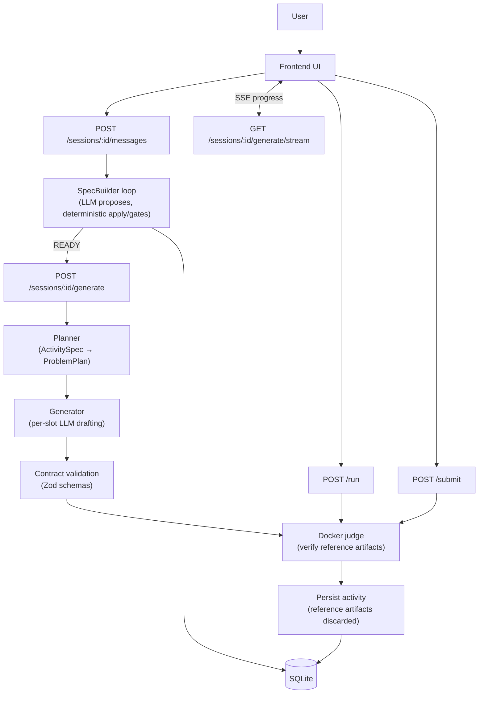

# Architecture

This document describes backend components and (more importantly) the invariants that hold the system together.

If you are new to the codebase, read:

1) `overview.md`  
2) this file  
3) `agentic-design/principles.md`

## Components (by responsibility)

### HTTP API (Express)

- Entry point: `src/server.ts`
- Sessions router: `src/routes/sessions.ts`

The API surface splits into:

- **Sessions + generation orchestration**: `/sessions/*`
- **Sandboxed execution/judging**: `/run`, `/submit`
- **Auth + profile**: `/auth/*`, `/profile`, `/profile/llm`
- **Activities**: `/activities/*`, `/community/activities*`

See `api/backend.md` for request/response details.

## Single end-to-end diagram

### Session orchestration (SpecBuilder)

Primary orchestration lives in `src/services/sessionService.ts`:

- Maintains the session state machine (`DRAFT → CLARIFYING → READY → GENERATING → SAVED/FAILED`).
- Applies deterministic gates:
  - validation/invariants
  - confirmation flow for “hard fields”
  - commitments to prevent churn
- Emits user-safe progress and (optional) trace events.

### Deterministic compiler boundary

“Compiler boundary” is the umbrella term for deterministic code that decides what is allowed to become persisted state.

Key modules:

- `src/compiler/specDraft.ts`: draft schema + fixed-field enforcement
- `src/compiler/jsonPatch.ts`: patch application
- `src/agent/fieldCommitmentPolicy.ts`: hard-field confirmation gating
- `src/agent/commitments.ts`: persistence of locked decisions

Key invariant: the LLM does not write to the database; it can only propose changes that pass these gates.

### Planner

`src/planner/index.ts` deterministically expands a validated `ActivitySpec` into a `ProblemPlan` (a list of per-problem “slots”).

Key properties:

- The same `ActivitySpec` must yield the same slot plan (stable ordering, stable topic distribution).
- Difficulty planning is enforced by schema: `difficulty_plan` must sum to `problem_count`.

See `agentic-design/planners.md` and `core-concepts/difficulty-planning.md`.

### Generation pipeline

`src/generation/*` performs per-slot generation:

- LLM drafts a `GeneratedProblemDraft` (includes reference artifacts).
- Draft is validated by contract (`src/contracts/problem.ts`).
- Reference artifacts are verified in Docker (compile + tests).
- For Guided Mode, a student-facing scaffold can be derived deterministically from the verified reference.
- Reference artifacts are discarded before persistence.

See `pipelines/generation.md`.

### Judge / sandbox

Language support is described by “profiles” and adapters under `src/languages/*` and `src/judge/*`.

- `/run`: non-graded execution
- `/submit`: graded execution with a test suite

Both run untrusted code in Docker. The backend enforces input size limits and file-layout constraints before invoking Docker.

See `pipelines/grading.md` and `api/backend.md`.

### Persistence (SQLite)

The backend uses SQLite (`better-sqlite3`) for:

- sessions + messages + collectors
- activities + problems
- submissions
- learner profiles (deterministic updates only)

Schema and migrations live in `src/database.ts`.

See `state-and-models.md`.

## System invariants (non-negotiable)

These invariants are intentionally enforced in code and should not be weakened casually:

1. **Durable state is produced by deterministic code paths only**.
2. **All persisted specs and problems satisfy strict Zod contracts**.
3. **Generated reference artifacts must be Docker-verified** before a problem is considered valid.
4. **Reference artifacts are never persisted** (and should never be streamed to clients).
5. **Session progression is a strict state machine**; no implicit transitions.
6. **User-facing progress/trace streams are sanitized** (no prompts, no raw model output).

If you change behavior, update the documentation in `agentic-design/*` to keep the invariants explicit.
